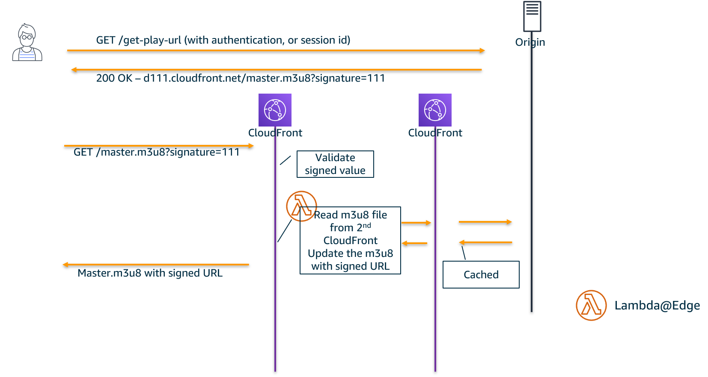
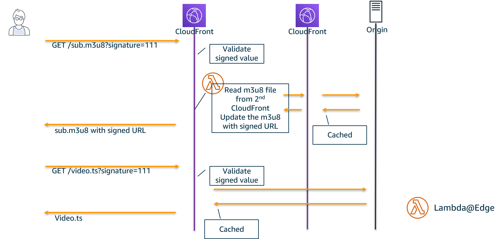

# Protect HLS streaming with signedURL and Lambda@Edge

This code sample shows how customer can update the HLS streaming playlist (`.m3u8`) to include signed URL query parameters with Lambda@Edge.  
The code also shows how to add a cross site resource sharing header.  
The code is a CloudFormation template file, which includes 2 CloudFront distribution and 2 Lambda@Edge function.  

Streaming customers whose client player doesn't support cookie faces difficulty to protect their HLS streaming, since the playlist (*.m3u8) contains segment file URL without the signed URL query parameters.  
To protect each segments, they need a mechanism in the content delivery to update manifest on the fly.  
This code example will help customers to understand how to implement their streaming workload for their specific requirement.   

# implementation

There are 2 CloudFront distributions, one is called as viewer distribution, and another is manifest distribution.  
Viewer distribution will deliver all of the streaming to end user, while manifest distribution is used only to cache manifest files.  
1. When a player opens a manifest, CloudFront will trigger Lambda@Edge function as origin request trigger.  
1. Lambda@Edge will read the manifest file, calculate signed URL for each URL in it, and update those URLs.  
1. This manifest will be served to player

1. When a player opens a segment file, it will use the signed URL
1. Viewer distribution will validate the signed value, and serve segment files
